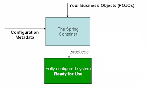
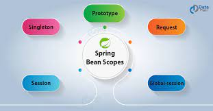

# Spring

## Overview

Spring is a POJO-based framework for Java that makes developing enterprise-level applications much easier due to its inversion of control. The IoC (Inversion of Control) container handles the creation of objects and the injection of dependencies between objects. In Spring, the objects that are managed by the IoC container are called "beans". 

## Benefits
 - Modular - able to develop POJO's separately and leave the dependency injection up to the IoC
 - Loose Coupling - depenedency injection allows objects to be injected without needing to know where they come from
 - Intuitive - due to the POJO-based implementation, Spring is simpler to use than other frameworks
 - Multi-Purpose - Spring has so many different projects that make use of pre-existing technologies, allowing developers to tackle all types of features (ORM, MVC, etc.)

## Overview of Spring projects:


## Beans
The objects that form the backbone of your application and that are managed by the Spring IoC container are called beans. They are manaed by the IoC container. Beans are created by the BeanFactory(lazy) or the ApplicationContext(eager). 

We see that the IoC container takes POJO's as well as some sort of configuration and produces a fully configured Java Application. 


### Configuration via XML
You can configure beans in an XML file. The benefit of this is that the configuration information can be found in a single place. The downside is that it can be a bit less intuitive than Annotation-based configuration. 

```
<bean id = "helloWorld" class = "com.revature.HelloWorld">
    <property name="message" value = "Dinosaurs!"/>
</bean>
    ```

### Configuration via Annotations
You can also directly configure the java classes using annotations. This is more intuitive for most people and allows the configuration to exist in the relevant classes, rather than an XML file. 

The 2 main annotations for Spring Core are:
1. @Configuration - class level, indicates that class is a source of bean definitions
2. @Bean - method level, indicates that the return value should be registered as a bean


### Bean Scopes
1. Singleton (default) - single instance per bean definition, stateless
2. Prototype - multiple instances per bean definition, stateful
3. Request - Application Context only
4. Session - AC only
5. Global Session - AC only


### Bean Lifecycle


### Dependency Injection
Objects "depend" on other objects. 

#### Constructor-based
1. Must match all fields of a constructor. 
2. Index-based or type-based constructor-args. 

#### Setter-based
1. Must have a no-arg constructor. 
2. Must have setters for all fields that you want to use. 
3. Don't need to configure all fields (program will still compile). 

Check out this [demo](https://github.com/220124-JavaReactAzure/demos/tree/main/spring-demo) for some practical experience. 